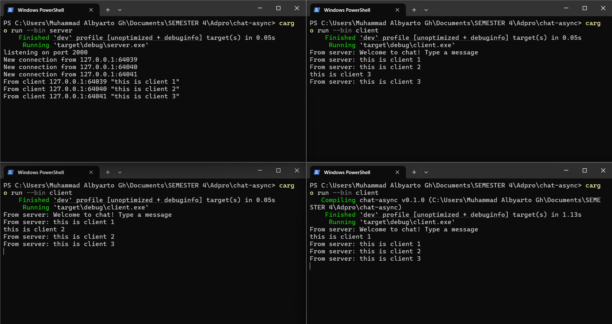

# Tutorial 10 Advance Programming
Muhammad Albyarto Ghazali (2306241695)

### 2.1. Original code of broadcast chat

**Screen Capture (one server, and three clients):**


Aplikasi ini merupakan simulasi sederhana dari sistem **chat real-time** berbasis **WebSocket** menggunakan library `tokio` dan `tokio-websockets`. Aplikasi terdiri dari dua komponen utama, server dan client. Server berfungsi sebagai pusat komunikasi yang menerima koneksi dari berbagai client dan meneruskan message dari satu client ke seluruh client lainnya. Sementara itu, client dapat mengirim message ke server dan menerima message dari client lain melalui server.

Untuk menjalankan aplikasi ini, langkah pertama yang harus dilakukan adalah menjalankan **server**. Buka terminal dan jalankan perintah `cargo run --bin server`. Server akan berjalan dan mendengarkan koneksi di alamat `127.0.0.1` port `2000`. Setelah server aktif, buka tiga terminal baru secara terpisah dan jalankan program **client** di masing-masing terminal menggunakan perintah `cargo run --bin client`. Dengan ini, akan ada tiga client yang aktif dan terhubung ke server.

Setiap client yang baru terhubung akan menerima message sambutan dari server: *"Welcome to chat! Type a message"*. Selanjutnya, pengguna dapat langsung mengetik message di terminal dan menekan Enter untuk mengirimkan message tersebut ke server. Setelah message dikirim, server akan menyebarkan (broadcast) message tersebut ke semua client yang terhubung, termasuk pengirimnya sendiri. Akibatnya, setiap client akan melihat message yang dikirim oleh client lain dalam waktu nyata. Misalnya, jika client pertama mengirimkan message “Halo semua!”, maka message tersebut akan langsung muncul juga di terminal client kedua dan ketiga. Begitu juga saat client lain mengirimkan message, seluruh peserta akan langsung menerimanya.

Semua proses komunikasi ini berjalan secara **asynchronous dan parallel** karena penggunaan `tokio::select!`, yang memungkinkan client handle input dari pengguna dan menerima message dari server secara bersamaan. Sistem ini mencerminkan bagaimana aplikasi chat modern bekerja di balik layar—dengan saling bertukar message melalui server menggunakan koneksi **WebSocket** yang stabil dan terus-menerus aktif.

---

### 2.2. Modifying the WebSocket Port

Untuk mengubah port WebSocket dari 2000 menjadi 8080 dan memastikan bahwa aplikasi masih dapat berjalan dengan benar. Karena komunikasi menggunakan WebSocket melibatkan dua sisi yaitu **server** dan **client**, maka perubahan port harus dilakukan di kedua sisi aplikasi agar koneksi tetap sesuai.

1. **Modifikasi di sisi server**

   File yang perlu diubah: `src/bin/server.rs`
   Pada baris di mana listener di-bind ke alamat, ubah:

   ```rust
   let listener = TcpListener::bind("127.0.0.1:2000").await?;
   ```

   menjadi:

   ```rust
   let listener = TcpListener::bind("127.0.0.1:8080").await?;
   ```

2. **Modifikasi di sisi client**

   File yang perlu diubah: `src/bin/client.rs`
   Pada baris koneksi WebSocket URI, ubah:

   ```rust
   ClientBuilder::from_uri(Uri::from_static("ws://127.0.0.1:2000"))
   ```

   menjadi:

   ```rust
   ClientBuilder::from_uri(Uri::from_static("ws://127.0.0.1:8080"))
   ```

Protokol yang digunakan tetap sama, yaitu `ws://`, yang berarti koneksi WebSocket tanpa enkripsi (berbeda dengan `wss://` yang terenkripsi dengan TLS). Protokol ini **tidak berubah**, yang berubah hanyalah port tempat server mendengarkan koneksi masuk dan tempat client mencoba terhubung. URI koneksi didefinisikan secara eksplisit dalam kode client pada bagian `ClientBuilder::from_uri(...)` dan harus cocok dengan alamat yang digunakan oleh server (`TcpListener::bind(...)`).

Jika hanya salah satu sisi yang diubah (misalnya hanya client saja), maka koneksi akan gagal karena client mencoba terhubung ke port yang tidak dibuka oleh server.

Setelah port diubah menjadi 8080 di kedua sisi, aplikasi dirun kembali. Server berhasil menerima koneksi dari semua client, dan pertukaran pmessage tetap berlangsung dengan lancar. Tidak ditemukan error atau gangguan dalam koneksi. Hal ini membuktikan bahwa perubahan port berhasil dilakukan dan sistem tetap berfungsi seperti sebelumnya.

---